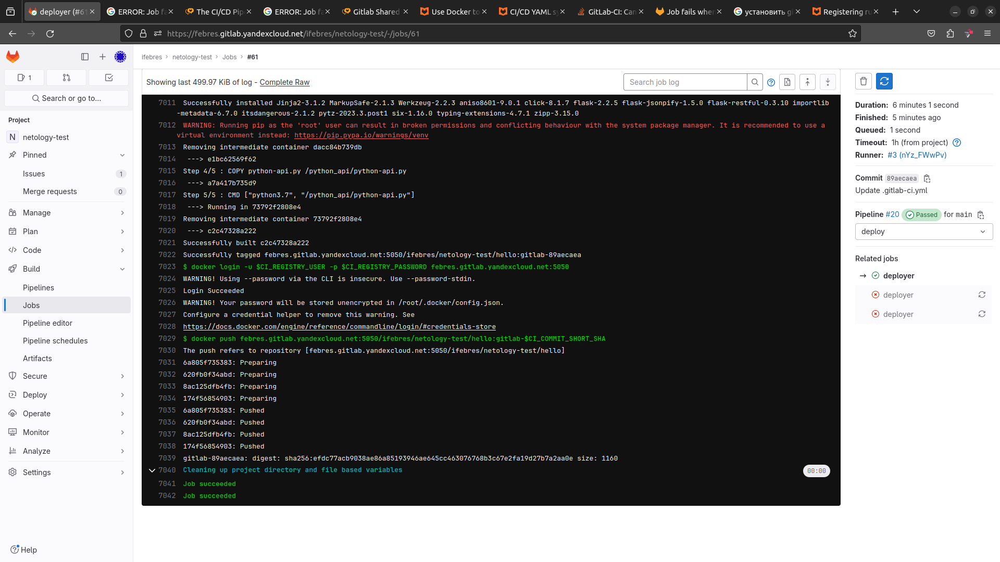
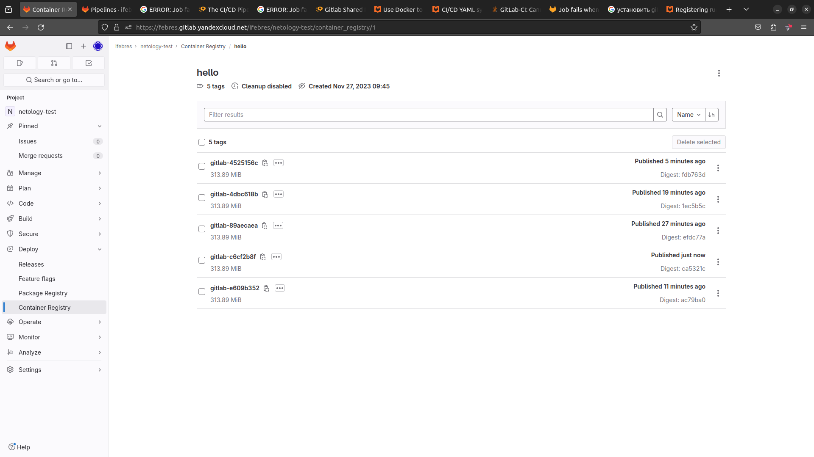
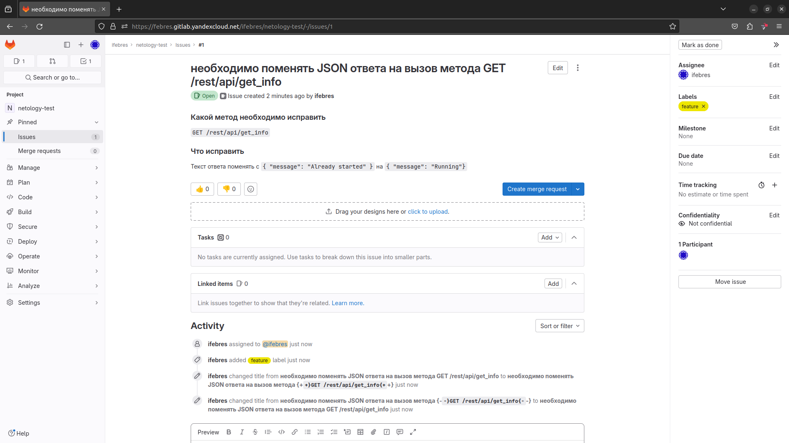
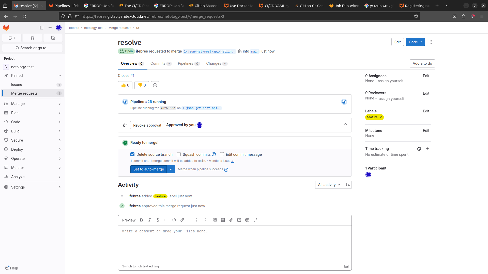
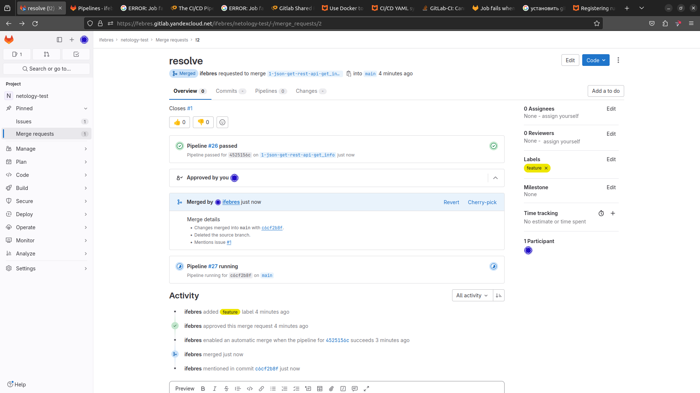
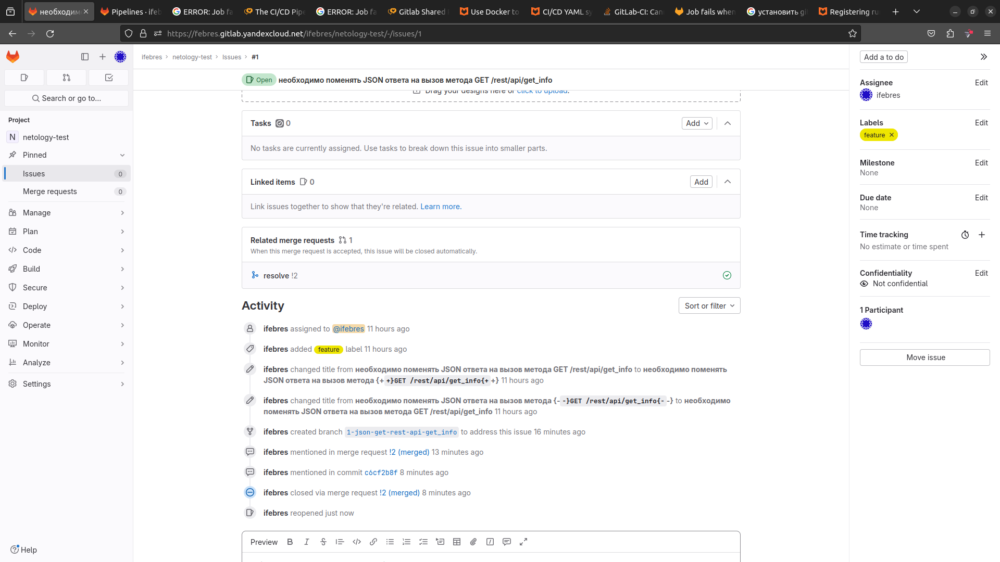
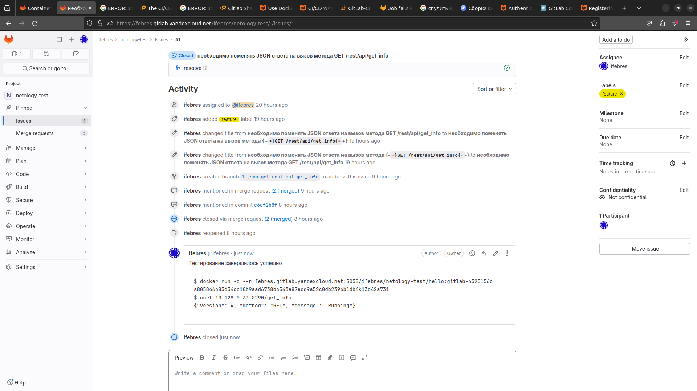

# Ответы к занятию 12 «GitLab»

### DevOps

В репозитории содержится код проекта на Python. Проект — RESTful API сервис. Ваша задача — автоматизировать сборку образа с выполнением python-скрипта:  
`Docker`
```dockerfile
FROM centos:7

RUN yum -y install wget make gcc openssl-devel bzip2-devel libffi-devel && \
    cd /tmp/ && \
    wget https://www.python.org/ftp/python/3.7.9/Python-3.7.9.tgz && \
    tar xzf Python-3.7.9.tgz && \
    cd Python-3.7.9 && \
    ./configure --enable-optimizations && \
    make altinstall && \
    ln -sfn /usr/local/bin/python3.7 /usr/bin/python3.7 && \
    ln -sfn /usr/local/bin/pip3.7 /usr/bin/pip3.7 && \
    python3.7 -m pip install --upgrade pip
RUN pip3.7 install flask flask-restful flask-jsonpify

COPY python-api.py /python_api/python-api.py
CMD ["python3.7", "/python_api/python-api.py"]
```
`Pipeline`
```yaml
stages:          # List of stages for jobs, and their order of execution
  - build
  - deploy

default:
  image: docker:20.10.22-dind
  services:
    - docker:20.10.22-dind
  before_script:
    - docker info

variables:
  DOCKER_TLS_CERTDIR: "/certs"
  DOCKER_DRIVER: overlay2

deployer:
  stage: deploy
  variables:
    DOCKER_TLS_CERTDIR: ""
  services:
    - docker:20.10.22-dind
  script:
    - docker build -t febres.gitlab.yandexcloud.net:5050/ifebres/netology-test/hello:gitlab-$CI_COMMIT_SHORT_SHA .
    - docker login -u $CI_REGISTRY_USER -p $CI_REGISTRY_PASSWORD febres.gitlab.yandexcloud.net:5050
    - docker push febres.gitlab.yandexcloud.net:5050/ifebres/netology-test/hello:gitlab-$CI_COMMIT_SHORT_SHA
```

`Registry`


### Product Owner



### Developer

`Merge request`

`Выполнена сборка`

`Активность в issue`


### Tester



### Файлы
[Dockerfile](repository%2FDockerfile)  
[.gitlab-ci.yml ](repository%2F.gitlab-ci.yml%20)

