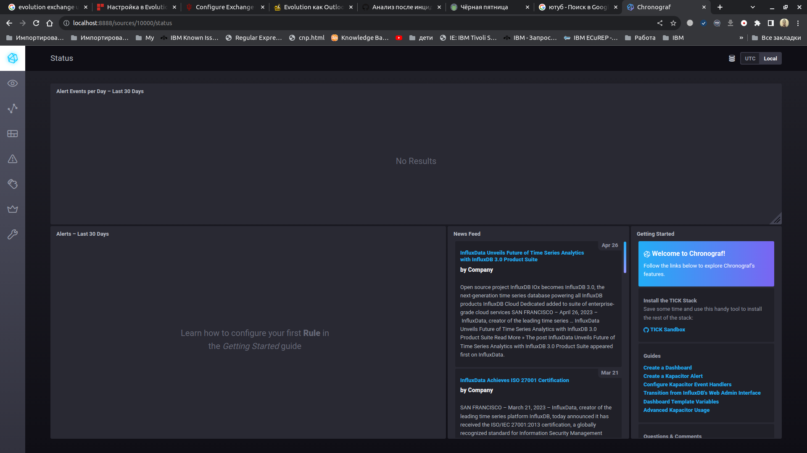
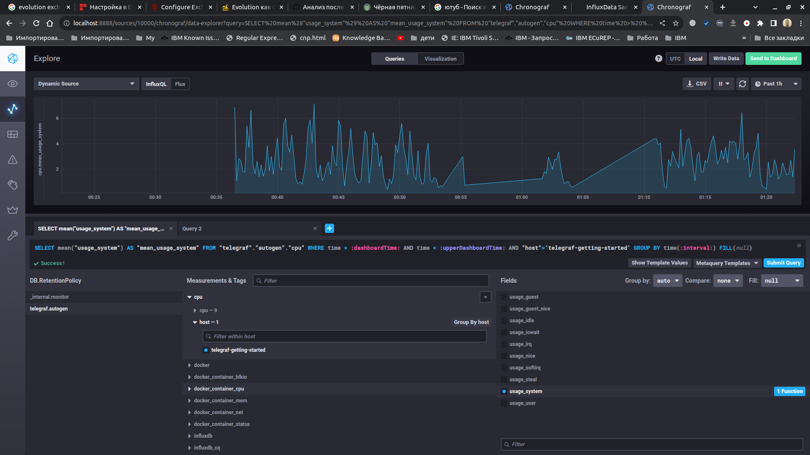
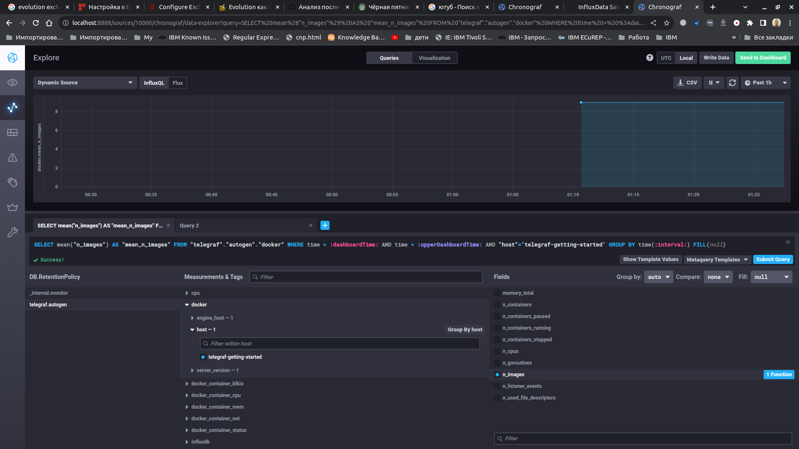

# Ответы к домашнему заданию по занятию "13. Системы мониторинга"

#### 1. Вас пригласили настроить мониторинг на проект.

   **Ответ:** 
    
HTTP-запросы и коды состояния:  
        Метрики: Количество HTTP-запросов, коды состояния (200 OK, 4xx, 5xx и т.д.).  
        Почему важно: Позволяет отслеживать активность системы, выявлять проблемы в обработке запросов и уровень удовлетворенности пользователей.

Время ответа HTTP:  
        Метрики: Среднее время ответа на HTTP-запросы.  
        Почему важно: Позволяет оценить производительность системы и обнаруживать возможные узкие места.

Нагрузка на ЦПУ:  
        Метрики: Загрузка ЦПУ (CPU utilization / CPU LA)).  
        Почему важно: Позволяет отслеживать нагрузку на вычислительные ресурсы и выявлять проблемы с производительностью.

Использование диска:  
        Метрики: Загрузка диска (Disk utilization).  
        Почему важно: Позволяет мониторить использование дискового пространства, что важно для сохранения отчетов на диск.

Доступность:  
        Метрики: Статусы доступности (uptime, downtime).  
        Почему важно: Позволяет отслеживать общую доступность системы и оперативно реагировать на проблемы с доступностью.

#### 2. Менеджер продукта не разбирается в технических показателях. Что вы можете ему предложить?

   **Ответ:** Разработать **SLA** (соглашение об уровне обслуживания) в рамках которого будут указаны **SLI** (показатель качества обслуживания) и **SLO** (целевой уровень качества обслуживания) для сервиса и его отдельных компонентов.  
   Это позволяет менеджеру не задумываясь о технических особенностях мониторинга понять общую картину сотояния работоспособности сервиса.
   

#### 3. Разработчики хотят видеть все ошибки, которые выдают их приложения. Но руководство не согласовало бюджет на систему мониторинга логов.

   **Ответ:** Приложение на GOlang, использовать возможности уже имеющихся систем: Zabbix (парсинг логов, различные запросы db/web/userparameter), Prometheus (отправка метрик в формате prometheus)
   
#### 4. Где у вас ошибка при вычислении SLA

   **Ответ:** Не учитены ошибки с кодами **1xx** и **3xx**.   
   `(summ_2xx_requests + summ_1xx_requests + summ_3xx_requests)/summ_all_requests`
   
#### 5. Опишите основные плюсы и минусы pull и push систем мониторинга.

   **Ответ:**  
   
   **Push** - плюсы:
- можно указать несколько точек отправки для репликации метрик
- более гибкая настройка отправки пакетов данных с метриками между агентами
- UDP — это менее затратный способ передачи данных, из-за чего может возрасти производительность сбора метрик
- Push-системы позволяют мгновенно передавать данные мониторинга в момент их появления.

**Push** - минусы:

- Push-системы часто более сложны в настройке, так как требуют конфигурации механизмов обработки входящих данных.
- при недоступности агента, невозможно понять причину.
- Push-модель может предоставить меньше контроля над тем, кто может отправлять данные, что может сделать ее менее безопасной.
  
**Pull** - плюсы:

- легче контролировать подлинность данных
- можно настроить единый proxy server до всех агентов с TLS для взаимодействия с сервером
- упрощённая отладка получения данных с агентов
  
**Pull** - минусы:

- Pull-системы могут иметь задержку в обновлении данных, поскольку сбор данных происходит по расписанию.
- если у целевого сервера много агентов для обслуживания, это может привести к увеличению нагрузки.
   
#### 6. Какие из ниже перечисленных систем относятся к push модели, а какие к pull? А может есть гибридные?
    - Prometheus 
    - TICK
    - Zabbix
    - VictoriaMetrics
    - Nagios

   **Ответ:**
   - **Prometheus** - в основном **pull** модель, но может использовать `push gateway`
   - **TICK** - **push** модель
   - **Zabbix** - **гибридная** модель
   - **VictoriaMetrics** - **гибридная** модель
   - **Nagios** - **pull** модель
   
#### 7. Веб-интерфейса ПО chronograf ([http://localhost:8888](http://localhost:8888)). 

   **Ответ:**

   
#### 8. Перейдите в веб-интерфейс Chronograf (`http://localhost:8888`) и откройте вкладку `Data explorer`.

  
   **Ответ:**  

#### 9. Метрики, связанные с docker. 

   **Ответ:**  

   
