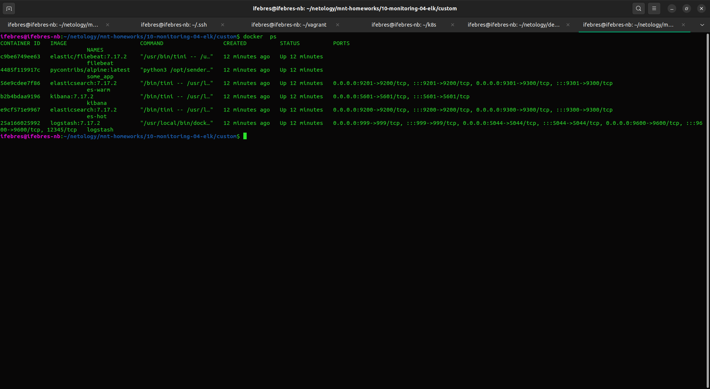
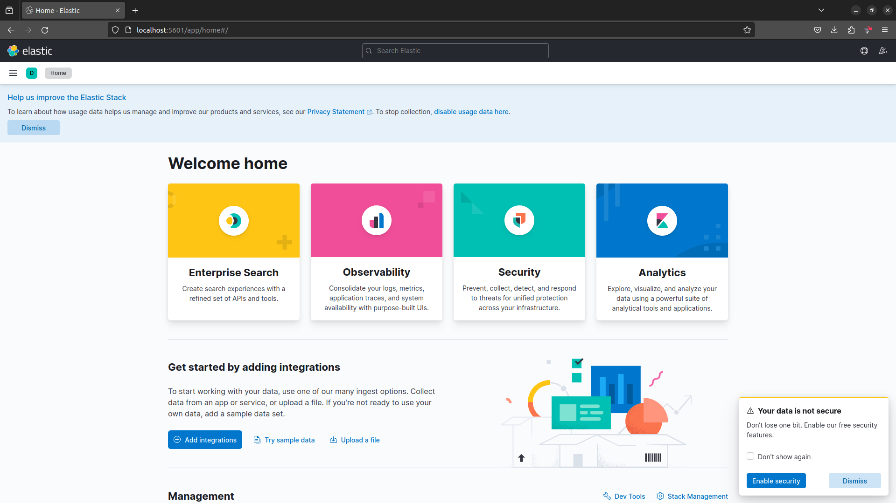
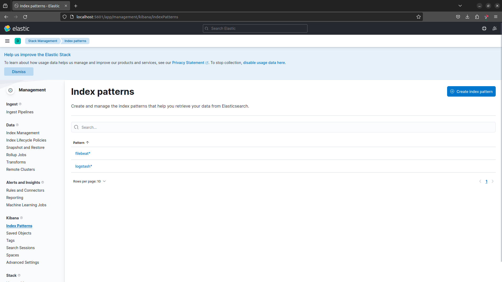
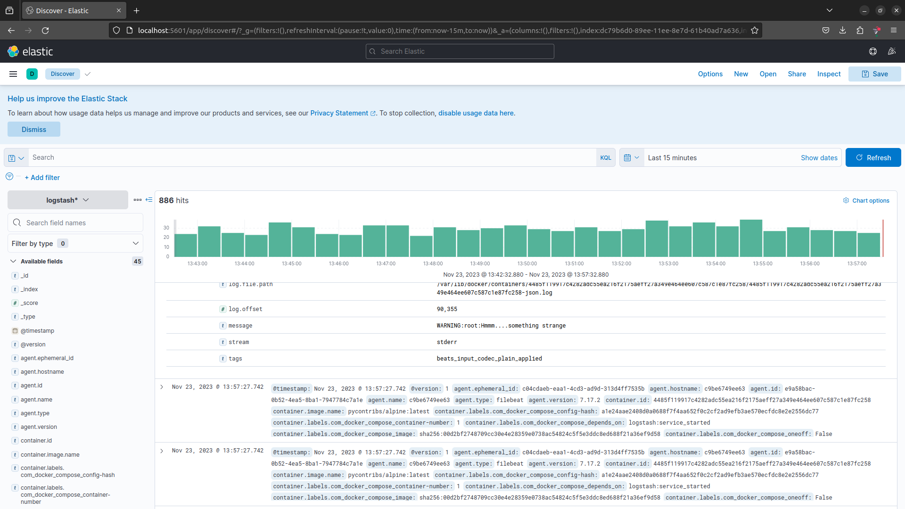

# Ответы к домашнему заданию по занятию 15 «Система сбора логов Elastic Stack»

#### Задание 1
- скриншот `docker ps` через 5 минут после старта всех контейнеров (их должно быть 5);
>
- скриншот интерфейса kibana;
>
- docker-compose манифест (если вы не использовали директорию help);
>[docker-compose.yml](custom%2Fdocker-compose.yml)
- ваши yml-конфигурации для стека (если вы не использовали директорию help).
>[filebeat.docker.yml](custom%2Ffilebeat%2Ffilebeat.docker.yml)

#### Задание 2

**Index pattern**

**Discover**

 
